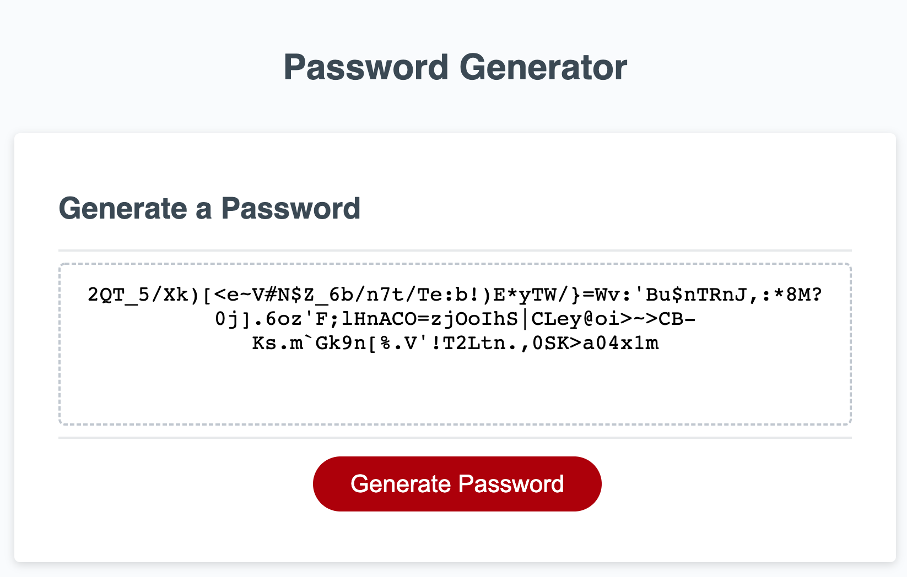

# JS-Password-Generator

This basic password generator functions off a series of prompts that collect user input data to generate a random string value according to a certain criteria. Character sets are first defined as arrays for the function to draw from, and prompts are used to determine which character sets to use and how long the user desires their password to be. The prompts store true/false values, and are concatted into an empty string variable. The randomly generated password is finally created by looping through each possible character selection, and adding each randomly selected character to the generated password string until the user's defined length is met. This password string is then passed on to the writePassword function and displayed on the page. 

A link to the deployed application can be found [here](https://cplancich.github.io/JS-Password-Generator/).